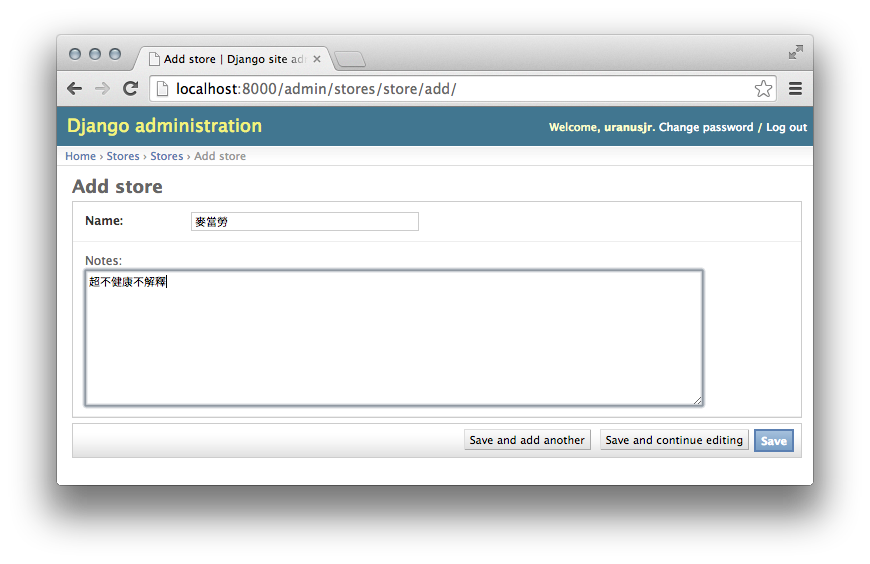
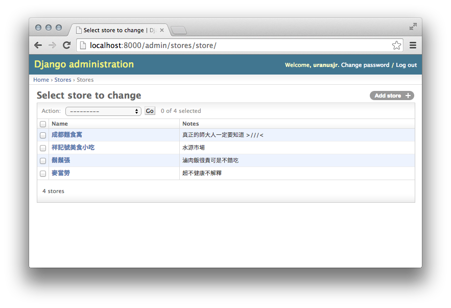

承接昨天的內容，我們現在要來建立幾筆店家資訊來看看。既然店家資訊是放在資料庫，我們可以直接用 SQL 把資料塞進去。或者，因為 Django 是用 ORM，我們也可以寫程式把東西放進去。不過在這種狀況下 command line 總是有點麻煩。有 GUI 的選擇嗎？

有。Django 內建了一個 admin 介面，方便你快速產生一個簡單的管理平台。打開 `lunch/settings/base.py`，確認 `INSTALLED_APPS` 有包含 admin app：

```python
INSTALLED_APPS = [
    'django.contrib.admin',         # 這一行啟用 Django admin。
    'django.contrib.auth',
    'django.contrib.contenttypes',
    'django.contrib.sessions',
    'django.contrib.messages',
    'django.contrib.staticfiles',
    'stores',
]
```

接著打開 `lunch/urls.py`，確認 `admin` 有被對應到 Django admin：

```python
urlpatterns = [
    path('', home, name='home'),

    # 這一行把 admin/ 下面的 URL 對應到 Django admin。
    path('admin/', admin.site.urls),
]
```

`urls.py` 本身的功能我們之後再講。

接著用以下的指令，建立一個超級使用者帳號（用來登入管理介面）：

```bash
pipenv run python manage.py createsuperuser
```

輸入帳號與密碼。（Pro tip: email 其實可以留白，直接按 enter 就行了！）

接著把 Django 跑起來：

```bash
pipenv run python manage.py runserver
```

然後用瀏覽器打開 <http://localhost:8000/admin/>。你應該會看到登入頁面，輸入剛剛的帳密後就可以進入管理頁面了！

不過我們之前建的 models 都沒有出來。因為我們沒有告訴 Django 要怎麼顯示它們。

打開 `stores/admin.py`，把內容改成這樣：

```python
from django.contrib import admin
from .models import Store

@admin.register(Store)
class StoreAdmin(admin.ModelAdmin):
    pass
```

我們建立了一個 store 專用的 admin，並用 `admin.register` 這個 decorator 來告訴 Django：請在 admin 中註冊 `Store` 這個 model，並使用 `StoreAdmin` 來顯示。

重新整理 admin 網頁（記得 `runserver` 要繼續跑，如果它停掉了請重新執行它）。你應該會看到多了一欄 `Stores`！

點右邊的 Add 來新增一筆資料。



按下 Save，就會多一筆資料。多建幾筆來看看！

資料多了之後，列表畫面好像就有點乾。我們來把 `notes` 欄位也顯示在上面。重新修改 `stores/admin.py`，把 admin class 改成下面這樣：

```python
@admin.register(Store)
class StoreAdmin(admin.ModelAdmin):
    list_display = ['name', 'notes']
```

這裡指定 `Store` 專用的 admin class 要在列表顯示 `name` 和 `notes`。

重新整理列表頁！你應該會看到多了一個 `Notes` 欄位。



我們再加上 `MenuItem` 的 admin：（記得 `import MenuItem`）

```python
@admin.register(MenuItem)
class MenuItemAdmin(admin.ModelAdmin):
    list_display = ['name', 'price']
```

現在你應該可以新增菜單上的項目了。而且 Django 還會自動把 foreign key 變成一個下拉選單，並且把你所有的項目都放進去！


不過這有點怪。通常我們新增店家的時候，都會直接加入菜單。現在這樣要先新增店家，再從 menu item 這裡新增菜單（然後選擇店家），很不方便。所以我們來用 Django admin 內建的 inline admin 功能，把 `MenuItem` 的 admin 嵌到 `Store` 的 admin 頁面裡。

先新增一個 inline admin：

```python
class MenuItemInline(admin.TabularInline):
    model = MenuItem
    extra = 1
```

然後把它加入 `StoreAdmin`：

```python
class StoreAdmin(admin.ModelAdmin):
    list_display = ['name', 'notes']
    inlines = [MenuItemInline]
```

進入一個 `Store` 的 admin 頁面看看。那家店的菜單變成一個表格被列在下面，而且 Django 還多給你一個空白列，讓你可以繼續新增！方便多了吧。

多多新增一些資料。之後會教你怎麼把這些東西列在網頁上給一般人看。

今天就到這裡！Django admin 還有很多很厲害的功能，有興趣的話請自行參照[文件](https://docs.djangoproject.com/en/2.0/ref/contrib/admin/)。
