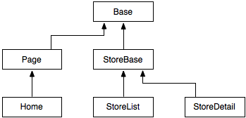

延續昨天的內容，我們繼續重構；今天的重點會放在 `stores` app。

## `get_absolute_url`

在 `stores/store_list.html` 中，我們用了一個 `url` tag 來得到某個店家的內容頁網址。但這個網址基本上和店家是一對一關聯，而且永遠和店家本身綁定。所以這個邏輯似乎應該被放到 model class，而不是 template——這樣如果哪天我們想把店家頁面換到其他地方，就不需要修改所有的 `url` tag。

在 `stores/models.py` 新增以下內容：

```python
from django.core.urlresolvers import reverse
```

然後為 `Store` model 加上一個 method `get_absolute_url`，讓它變成下面這樣：

```python
class Store(models.Model):

    name = models.CharField(max_length=20)
    notes = models.TextField(blank=True, default='')

    def __str__(self):
        return self.name

    def get_absolute_url(self):
        return reverse('store_detail', kwargs={'pk': self.pk})
```

`reverse` 的用途與 `url` tag 相同，但 capture groups 的值是使用 `kwargs` 參數傳入。Method 名稱沒有規定，`get_absolute_url` 只是 Django 社群的習慣。

打開 `stores/templates/store_list.html`，把 `<h2>` 那行改成這樣：

```html
<h2><a href="{{ store.get_absolute_url }}">{{ store.name }}</a></h2>
```

記得，在 template 中呼叫 function 與 method 時不需要加後面的括弧！

## Store Templates

來把 `stores` 的 templates 放到子目錄內。在 `stores/templates` 裡建立 `stores`，把 `store_list.html` 與 `store_detail.html` 丟進去，然後修改 `store/views.py`，以指向正確的 template 路徑：

```python
def store_list(request):
    # ...
    return render(request, 'stores/store_list.html', {'stores': stores})

def store_detail(request, pk):
    # ...
    return render(request, 'stores/store_detail.html', {'store': store})
```

你可能會疑惑，既然都放在 `stores` 裡面了，為什麼名稱還要有 `store`。呃⋯⋯一個解釋是，因為 app 裡面可以有超過一個 model。我們的 `stores` app 中有 `Store` 與 `MenuItem`，所以你可能會有 `stores/menuitem_list.html` 與 `stores/menuitem_detail.html`。實務上你當然可以把 `store` 省掉，不過 Django 習慣上會保留。

總之，再跑跑測試，應該還是要正常。目前的專案結構：

```
lunch
├── lunch
│   └── (省略)
├── stores
│   ├── templates
│   │   └── stores
│   │       ├── store_detail.html
│   │       └── store_list.html
│   ├── __init__.py
│   ├── admin.py
│   ├── models.py
│   ├── tests.py
│   └── views.py
├── pages
│   └── (省略)
└── manage.py
```

你可以能已經注意到，我們的三個 templates 中有非常多重複的東西。至少 navbar 整個都重複啦！這樣實在不好，如果哪天我們要改 navbar 內容，肯定會忘記什麼東西。在 Django 中，通常會使用 template inheritance 解決這個問題。

Template inheritance 和一般 OOP 的繼承差不多。如果我們把 template 想成普通的類別，就會想出類似這樣的繼承鏈：



你可能會想把好像沒什麼用的 base classes（例如 `Page`）拿掉。其實也是可以啦，不過如果你有很多很多頁面時，或許就會想要它們。畢竟是教學，就把它們建出來吧。

首先是 `base.html`。這建在哪都可以，不過我的習慣是另外創一個 app 來放：

```
python manage.py startapp base
```

然後建立 `base/templates/base.html`：

```html
<!DOCTYPE html>
<html>
<head>
<title>午餐系統</title>
<link rel="stylesheet" href="//maxcdn.bootstrapcdn.com/bootstrap/3.2.0/css/bootstrap.min.css">
</head>

<body>

<nav class="navbar navbar-default navbar-static-top" role="navigation">
  <div class="container">
    <div class="navbar-header">
      <a class="navbar-brand" href="">午餐系統</a>
    </div>
  </div>
</nav>

</body>
</html>
```

我們把應該要共用的 Bootstrap CDN link 與 navbar 放在 base class (template)。Block-endblock tag 是 Django 用來標注某個區塊可以被 override 的語法。

記得把 `base` 加入 `INSTALLED_APPS`：

```python
INSTALLED_APPS = [
    'pages',
    'stores',
    'base',
    # ...
]
```

因為 `base` 是上面兩個 apps 的基礎，所以我習慣放在下面。

接著在 `pages/templates/pages` 裡也建立一個 `base.html`，用來代表上面的 `Page` class：

```html

```

Extend tag 是用來表示我們要繼承 `base.html`。因為我們不需要複寫什麼東西，所以這麼一行就夠了。

接著是 `pages/templates/pages/home.html`：

```html



{{ block.super }}

```

我們可以用 block-endblock 語法，來指定複寫 parent class (template) 的某個區塊。`block.super` 是一個特殊值，代表「請把原本的 block 內容放在這裡」，大致上就和 OOP 呼叫 super 函式的概念一樣。

再來 `stores/templates/stores/base.html`：（新增檔案）

```html



{{ block.super }}
<div class="container"></div>

```

可以看到，block 裡面可以再有 block。因為我們的店家資訊都會包在 container 裡，所以之後可以寫在 content block 裡。

剩下的就一次出清：

```html
{# stores/templates/stores/store_list.html #}



店家列表 | {{ block.super }}



<div class="store">
  <h2><a href="{{ store.get_absolute_url }}">{{ store.name }}</a></h2>
  <p>{{ store.notes }}</p>
</div>


```

```html
{# stores/templates/stores/store_detail.html #}



{{ store.name }} | {{ block.super }}


<h1>{{ store.name }}</h1>
<p>{{ store.notes }}</p>
<table class="table">
  <thead>
    <tr><th>品項</th><th>單價</th></tr>
  </thead>
  <tbody>
    
    <tr><td>{{ item.name }}</td><td>{{ item.price }}</td></tr>
    
  </tbody>
</table>

```

經過前面的解釋，應該不難理解了。再跑一次測試！如果你上面都沒做錯，應該還是會成功。雖然我們把東西大搬風了一陣，但該出現的還是都應該出現，只是改用繼承，而不是直接寫死。我們來把店家列表連結放到 navbar，證明所有頁面都會跟著改變：

```html
{# base/templates/base.html #}

<!-- 取代 nav 元件 -->
<nav class="navbar navbar-default navbar-static-top" role="navigation">
  <div class="container">
    <div class="navbar-header">
      <a class="navbar-brand" href="">午餐系統</a>
    </div>
    <div>
      <ul class="nav navbar-nav">
        <li><a href="">店家列表</a></li>
      </ul>
    </div>
  </div>
</nav>
```

有改變吧！

大概就先到這裡。這次講的架構有些其實在小專案中根本是自找麻煩，所以如果你未來沒有特別需求，可以自由簡化這個架構。但多寫總比少寫好——如果你未來有需要，總是可以再回來看看！
