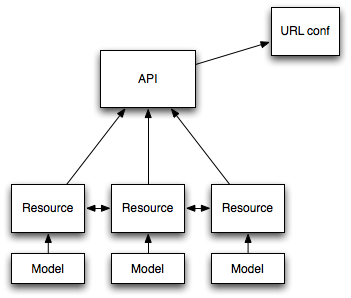

網站好像做完了，有點沒梗怎麼辦。XD

剩下的篇幅好像也不多，就來討論一些比較常被問到的主題吧。不過說真的我也不太確定大家（有人嗎？）想聽什麼。就經驗來看，詢問度最高的好像是要怎麼用 Django 做 REST API，所以今天就先講這個。方便起見就還是用原本的專案來舉例。不過這些就不是原本網站的一部分，只是額外加上去的，所以如果有些東西看起來不太合，就請包涵了。

若你不知道 REST 是什麼，請看[維基百科](http://zh.wikipedia.org/zh-tw/REST)。不管是為了 mobile client、在網頁上用 AJAX、甚至想把前端整個換成 AngularJS 之類的，總之我們現在需要一個 REST API。

說到 AJAX，我們前面其實就有做過這種東西了嘛。如果你只是想讓幾個 view 回傳 JSON 之類的東西，其實根本用不著什麼技巧；Django 的 CBV 本身就提供 CRUD 封裝，JSON 和 XML serializer 更是 Python 內建，所以只要用幾個 CBV、稍微改寫幾個 methods，就可以輕鬆做出簡單的 REST API。Django Braces 也有一些好用的 mixins 可以協助。不過如果你需要比較完整的 REST API，或者要實作的東西比較多——例如 authentication/authorisation、throttling、同時支援不同的 formats、處理 foreign keys 等等，就可以考慮使用一個完整的 REST API library。

現在 Django 界比較慣用的 REST API framework 主要有兩個：Django REST framework 和 Tastypie。用法其實差不多，都是用類似 CBV 的架構（雖然不見得是真的用 CBV）把一些 boilerplate code 簡化掉，來表達你想呈現的資源，例如 ORM 的 model 等等。

廢話太多了。總之這兩者的架構都差不多是這樣：



如果想建立一個基於 ORM model 的 REST API，我們需要依下面的概念設定：

1. 為每個需要的 model 建立一個 resource，並把它們註冊到一個共用的 API object。
2. 把上述 API object 連結到某個 URL 底下，讓它負責把 request URI map 到正確的 resource 上。
3. 當使用者訪問某個 API URI 時，對應的 resource 會根據我們給它的定義處理 auth-auth、throttling、(de)serialisation 等，並產生對應的 ORM query 對 model 進行存取。

我們來為 lunch 網站做個簡單的 REST API。因為篇幅關係，權限管理會單純一點（而且老實講我之前的網站也沒規劃得很好 XD）：

1. 已登入的使用者可以建立店家，並修改和刪除自己建立的店家。
2. 使用者可以為自己建立的店家新增/修改/刪除菜單項目。
3. 所有人都可以瀏覽店家列表與單一店家資訊。

所有 API 都使用 JSON，認證都是用 Django 預設的 session 認證。

我們一個一個來。

## Django REST Framework

安裝：

```bash
pip install djangorestframework
```

啟用：

```python
# lunch/settings/base.py

INSTALLED_APPS = (
    ...
    'rest_framework',
)
```

從上面的需求看來，大部份的資源都是必須登入才能使用（除了包含菜單的店家資訊之外），所以我們新增以下的設定，指名預設權限：

```python
# lunch/settings/base.py

REST_FRAMEWORK = {
    # Django REST Framework 預設就是使用 JSON，所以不用設定。
    # 使用 session 登入。
    'DEFAULT_AUTHENTICATION_CLASSES': (
        'rest_framework.authentication.SessionAuthentication',
    ),
    # 必須登入才能使用。
    'DEFAULT_PERMISSION_CLASSES': (
        'rest_framework.permissions.IsAuthenticated',
    ),
}
```

接著我們為需要的 models 建立 resources——在 Django REST Framework 中稱作 view sets：

```python
# stores/api.py

from rest_framework import viewsets, serializers, permissions
from .models import Store, MenuItem

class MenuItemRelatedSerializer(serializers.ModelSerializer):
    class Meta:
        model = MenuItem
        fields = ('name', 'price',)

class StoreSerializer(serializers.ModelSerializer):

    menu_items = MenuItemRelatedSerializer(many=True)

    class Meta:
        model = Store

class StoreViewSet(viewsets.ModelViewSet):
    queryset = Store.objects.all()
    serializer_class = StoreSerializer
    permission_classes = (permissions.IsAuthenticatedOrReadOnly,)
```

我們為 `Store` 與 `MenuItem` 各建立一個 view set，包含列表頁、細節頁的 CRUD 功能。預設會列出 model 的所有資訊。這對 menu item 而言夠了，但對 store 而言不夠好——因為我們還想列出與店家相關的菜單項目。為了達到這個目的，我們必須為這個 view set 建立一個 serializer，要求把 `menu_items` attribute（記得嗎？這是 Django 自動加入的 reverse relation field）也列出（`many=True` 代表這是個 to-many 關聯）。預設狀況下 Django REST Framework 只會列出 related objects，但我們想把 menu item 的內容 inline，所以同樣要為 menu item 建立 serializer，並明確指定要使用它來 serialize menu item。最後，因為我們希望未登入的人也能看（記得我們前面設定的預設權限是僅已登入者可使用），所以把 permission 改設成 `IsAuthenticatedOrReadOnly`。

現在我們有店家列表與單一店家資訊（含其中菜單），也可以新增與更新店家資訊，但如果我們只想為某個店家新增、修改或刪除一個菜單項目，需要對該項目 PUT 並包含它其他所有的 menu items，不是很方便。所以我們來為 menu item 單獨製作一個細節頁的 CUD（沒有 R）view：

```python
# stores/api.py

from rest_framework import mixins

class MenuItemViewSet(mixins.CreateModelMixin, mixins.UpdateModelMixin,
                      mixins.DestroyModelMixin, viewsets.GenericViewSet):
    queryset = MenuItem.objects.all()
```

就這樣！作法其實和 CBV 差不多，我們在這裡不是用 all-in-one 的 `ModelViewSet`，而是用什麼都沒有的 `GenericViewSet`，然後手動把需要的功能用 mixins 加入。我們只加入 create、update 和 destroy，所以就只會有 CUD 功能。記得我們的預設權限是只有登入才能使用，所以這裡就不用再指定 permission 了，設定 model 即可。

接著我們要把這些 view sets 註冊到 API object（在 Django REST Framework 中叫 router）裡：

```python
# lunch/api.py

from rest_framework import routers
from stores.api import StoreViewSet, MenuItemViewSet

v1 = routers.DefaultRouter()
v1.register(r'store', StoreViewSet)
v1.register(r'stores/menu_item', MenuItemViewSet)
```

我們建立了一個 router，然後把兩個 view sets 註冊進去。然後把 router 加入 URL conf：

```python
# lunch/urls.py

from .api import v1

urlpatterns = patterns(
    # ...
    url(r'^api/v1/', include(v1.urls)),
)
```

`register` 的第一個參數是 prefix，所以這樣就會產生如下的 API：[註 1]

Path pattern            | 功能
------------------------|------
/api/v1/store/          | GET 店家列表與 POST 建立新店家
/api/v1/store/<pk>      | GET 店家資訊，PUT 更新店家，PATCH 部分更新，DELETE 刪除
/api/v1/stores/menu_item/      | POST 建立新菜單項目
/api/v1/stores/menu_item/<pk>  | PUT 更新、PATCH 部分更新、DELETE 刪除


## Tastypie

安裝：[註 2]

```bash
pip install git+https://github.com/django-tastypie/django-tastypie.git
```

設定：

```python
# lunch/settings/base.py

INSTALLED_APPS = (
    # ...
    'tastypie',
)

# ...

# Tastypie 預設使用 XML，且必須明確在每個 resource 中指定 auth/auth 資訊。
TASTYPIE_DEFAULT_FORMATS = ('json',)
```

Tastypie 預設附了一個 API key 的 model，所以我們要建立它：

```python
python manage.py migrate
```

接著宣告。注意 Tastypie 習慣用的模組名稱是 `resources`：

```python
# stores/resources.py

from tastypie import resources, fields, authentication, authorization
from .models import Store, MenuItem

class ReadOnlyAuthentication(authentication.Authentication):
    def is_authenticated(self, request, **kwargs):
        if request.method.lower() == 'get':
            return True
        return False

class MenuItemRelatedResource(resources.ModelResource):
    class Meta:
        queryset = MenuItem.objects.all()
        fields = ('name', 'price',)

class StoreResource(resources.ModelResource):

    menu_items = fields.ToManyField(
        to=MenuItemRelatedResource, attribute='menu_items', full=True,
    )

    class Meta:
        queryset = Store.objects.all()
        resource_name = 'store'
        authentication = authentication.MultiAuthentication(
            ReadOnlyAuthentication(),
            authentication.SessionAuthentication(),
        )
        authorization = authorization.DjangoAuthorization()

class MenuItemResource(resources.ModelResource):
    class Meta:
        queryset = MenuItem.objects.all()
        resource_name = 'stores/menu_item'
        list_allowed_methods = ('get', 'post',)
        detail_allowed_methods = ('post', 'put', 'delete', 'patch',)
        authentication = authentication.SessionAuthentication()
        authorization = authorization.DjangoAuthorization()
```

註冊：

```python
# lunch/api.py

from tastypie.api import Api
from stores.resources import StoreResource, MenuItemResource

v2 = Api(api_name='v2')
v2.register(StoreResource())
v2.register(MenuItemResource())
```

```python
# lunch/urls.py

from .api import v2

urlpatterns = patterns(
    # ...
    # 必須放在 api/v1/ 後面，才不會把它的 patterns 吃掉。
    url(r'^api/', include(v2.urls)),
)
```

可以看到 Tastypie 的風格和 Django REST Framework 不同，比較像 model 和 form 的寫法，是用 `Meta` 來描述，並且直接把額外的欄位宣告（同樣需要明確宣告 to-many field！）放在 resource 裡，而不是使用一個額外的 class。描述的風格也不太一樣：

* 指定 query set，而非 model class。（其實 Django REST Framework 也可以改指定 query set，指定 model 時就是用 `all()`；只是 Tastypie **一定要**指定 query set。）
* 有獨立的 `ToMany` 欄位（也有 `ToOne`），並直接提供 `full=True` 選項直接展開 resource。
* 直接在 resource 中設定可以使用的 methods，而不是使用 mixin。
* Resource 的 URI prefix 是直接在 meta 中設定 `resource_name`，而不是在註冊時設定。
* 必須在所有 resources 中明確指定 auth/auth 資訊。
* 沒有像 Django REST Framework 那麼豐富的 auth 選項，必須自己實作 `ReadOnlyAuthentication` 結合內建的 `MultiAuthentication` 達到需求。

但整體而言應該也很容易理解。產生的 API 也基本與前面相同，只是把 `v1` 換成 `v2`。

整體而言可以看到兩個 libraries 各有功能比較強的地方，而且風格差距頗大。但是他們都能完成你想要的任務，所以要選哪個就是個人風格。以我自己的經驗來看，Tastypie 在需要建立很「標準」的 REST API，尤其 resource 與你的 data backend 結構非常接近時，會比 Django REST Framework 容易描述，但後者在描述比較複雜的 queryset filtering，尤其需要進行複雜的 join 查詢時，支援比較好。所以依需求選擇也是一個方法，但無論如何兩者都可以辦到任何事情，只是內建提供多少功能，你又需要自己實作多少功能的差異而已。

對了，你可能已經注意到，Django REST Framework 提供了一系列很方便的 HTML API test views，而 Tastypie 基本上在測試時只能靠額外的 client（例如 cURL）來使用。或許這也是誘因之一，雖然我個人習慣都用 unit tests 來測試，所以這部分比較無感。

## Deployment

最後我們來把今天更新的東西部署到伺服器上面去。首先把新安裝的套件加入 `requirements.txt`：

```
django-tastypie
djangorestframework
```

我們在 deploy 到 Ubuntu server 那章也提過，這個 requirements 檔案其實就是用來列出所有需要的套件，方便你用 `pip install -r` 一次裝好。所以當我們有新安裝任何套件時，就應該更新這裡的內容。[註 3]

### Heroku

把今天的內容 commit 進 Git repository：

```bash
git add .
git commit -m "Add REST API"
```

然後 push 上去：

```bash
git push heroku master
```

這樣應該就行了！Heroku 應該會把剩下的設定完成。

### Ubuntu Server

把新版的專案上傳上去之後，同樣進入 venv 並設定環境變數：

```bash
. venv/lunch/bin/activate
export DJANGO_LUNCH_SECRET_KEY=<your_secret_key>
export DJANGO_LUNCH_DATABASE_DEFAULT_USER=<your_db_user>
export DJANGO_LUNCH_DATABASE_DEFAULT_PASSWORD=<your_db_pass>
export DJANGO_SETINGS_MODULE=lunch.settings.deploy_ubuntu
```

然後用 PIP 把 requirements file 的更新安裝進去：

```bash
pip install -r lunch/requirements.txt
```

注意到 PIP 會自動跳過你已經安裝的套件，所以這裡只會安裝兩個新的（Tastypie 和 Django REST Framework）。

Migrate 資料庫（Tastypie 有用到）與收集靜態檔（Django REST Framework 的網頁 API view 需要）：

```bash
python manage.py migrate
python manage.py collectstatic
```

然後要求 Supervisor 重開你的 instance，並重啟 nginx（後者其實不一定需要）：

```bash
sudo supervisorctl restart lunch:site
sudo service nginx restart
```

就完成了！

唔，這篇好長。不過應該都是滿直觀的內容，只要有文件可以查應該都不難理解。就到這邊吧。

---

註 1：還有一些額外的，但我們關心的只有這些。

註 2：Tastypie 的 Django 1.8 支援尚未正式釋出，所以這邊使用了 PIP 的 Git 功能安裝開發版本。正式支援應該會在 0.12.2 版之後發佈，到時候只要用 `pip install django-tastypie` 即可安裝。

註 3：如果想瞭解更詳細的 requirements file 語法與使用技巧，可以參照 PIP 的[官方文件](http://pip.readthedocs.org/en/latest/user_guide.html#requirements-files)。
